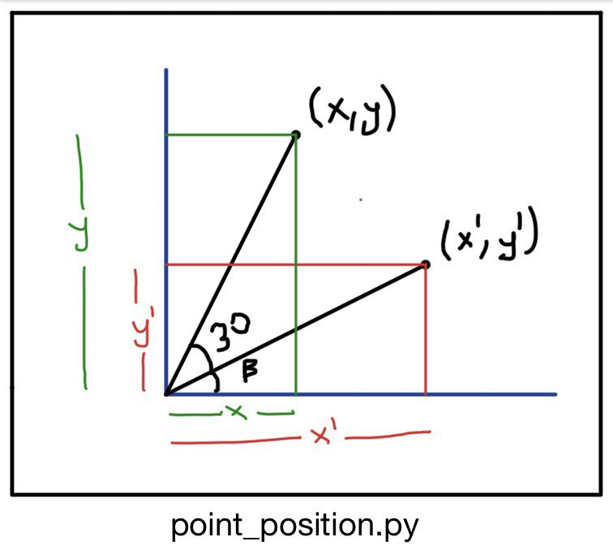

# circle_equ.py

Circle equation with 3 points known:
(x-x1)^2 + (y-y1)'2 = (x-x2)^2 + (y-y2)'2 = (x-x3)^2 + (y-y3)'2  = r^2 

So we can extract this equations:

# x1^2 - x2^2 + y1^2 - y2^2 = x(x1-x2)/2 + y(y1-y2)/2

# x1^2 - x3^2 + y1^2 - y3^2 = x(x1-x3)/2 + y(y1-y3)/2

With this equations, we are going to find center(x,y) and radius

---------------------------------------------------------------------

x' = tx
y' = ty

#	tx-cx = rcos(ẞ) (1)
#	ty-cy = rsin(ẞ) (2)

#	ẞ : Angle between |MP2| and x axis 
#	
#	x-cx = cos(angle+ẞ) = cosẞcos30 - sinẞsin30
#	y-cy = sin(angle+ẞ) = sinẞcos30 + cosẞsin30
#
#	Now we will use equation (1) and (2) instead of cos(ẞ) and sin(ẞ) 
#
#	x-cx = (tx-cx)cos30 / r + (ty-cy)sin30 / r
#	y-cy = (ty-cy)cos30 / r + (tx_cx)sin30 / r
